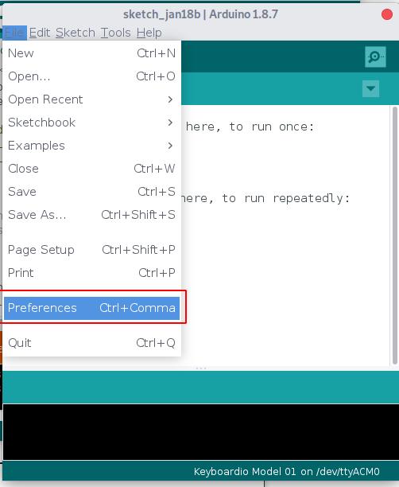
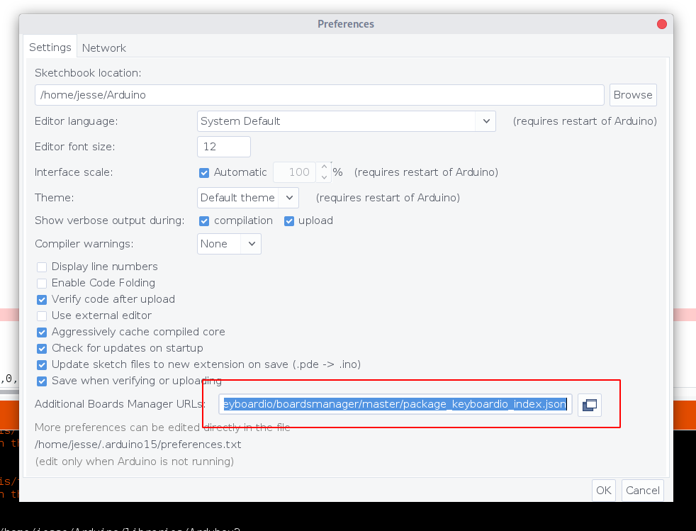
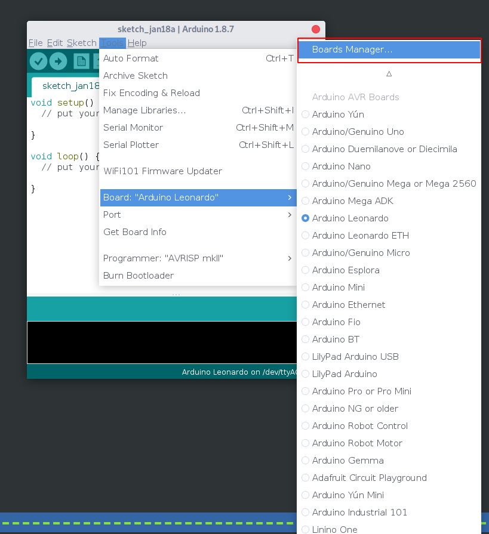
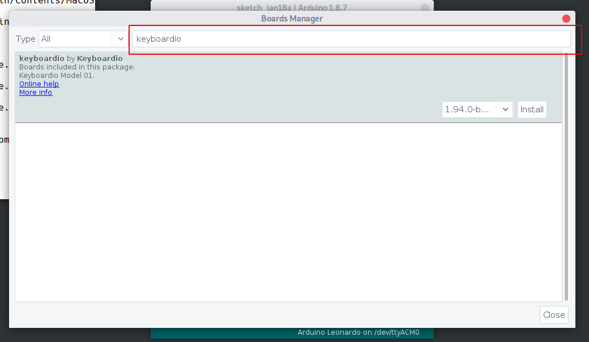
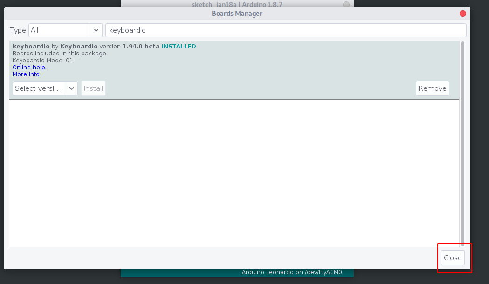

# Setting up your development environment


Arduino is one of the world's most widely used (and user friendly) platforms for programming "embedded" devices like the chip inside your keyboard.

To customize your keyboard's layout or functionality, the most robust and flexible option is to use the Arduino IDE.

If you're planning to modify Kaleidoscope itself or plan on developing Kaleidoscope plugins, you should be checking out the source code from our git repository instead. You can find instructions for that at https://github.com/keyboardio/Kaleidoscope


# Set up the Arduino IDE

Arduino's designers made it to be accessible to people at all skill levels, and Kaleidoscope is built on top of the Arduino platform because we share that goal. The easiest way to customize your keyboard's firmware is to use the Arduino IDE. Even if you expect to use the command line to compile your firmware, you'll still need to install Arduino, as they provide the compilers and libraries Kaleidoscope needs to work.

Using the IDE is is the easiest process for folks who are new to Arduino, or to programming generally. If you follow the instructions below step by step you should be fine. :-)


The right way to install Arduino is a little bit different depending on what operating system you use.

* [Install Arduino on macOS](#Arduino-macOS)
* [Install Arduino on Linux](#Arduino-Linux)
* [Install Arduino on Windows 10](#Arduino-Windows)
* [Install Arduino on FreeBSD](#Arduino-FreeBSD)


## <a name="Arduino-macOS"></a>Install Arduino on macOS

1. Download the Arduino IDE install package from https://www.arduino.cc/en/Main/Software

As of this writing, the latest version is v1.8.13, which you can download from https://www.arduino.cc/download_handler.php?f=/arduino-1.8.13-macosx.zip

2. Double-click "arduino-1.8.13-macos.zip" to uncompress the Arduino IDE.

3. Move Arduino.app from your `Downloads` folder to your Applications folder.

4. Double-click on Arduino.app to start it.

Next step: [Add keyboard support to Arduino](#add-keyboard-support-to-arduino)


## <a name="Arduino-Linux"></a>Install Arduino on Linux

1. Install version 1.8.13 or newer of the Arduino IDE from:
   ```sh
   Tar archive: http://arduino.cc/download
   Flatpak:     https://flathub.org/apps/details/cc.arduino.arduinoide
   Snap:        https://snapcraft.io/arduino
   Arch:        sudo pacman -S arduino
   ``` 
   Unfortunately, the version of the Arduino IDE packaged in Ubuntu is unmaintained and too old to use, and the version packaged in Debian has been heavily modified and might not be able to compile your keyboard's firmware.

2. Assuming you're using the tar archive, and untarring in the download directory:

    ```sh
    $ cd ~/Downloads
    $ tar xvf arduino-1.8.13-linux64.tar.xz
    $ sudo mv arduino-1.8.13 /usr/local/arduino
    $ cd /usr/local/arduino
    $ sudo ./install.sh
    ```
    
3. On some linux distributions, ModemManager can prevent you from flashing or updating your keyboard by interfering with its virtual serial port. Additionally, by default, you may not have permissions to access your keyboard's serial port. `udev` is the Linux subsystem that managed both of these things. You should install our udev rules to manage access to your keyboard's serial port.

    ```sh
    $ wget https://raw.githubusercontent.com/keyboardio/Kaleidoscope/master/etc/60-kaleidoscope.rules
    $ sudo cp 60-kaleidoscope.rules /etc/udev/rules.d
    $ sudo /etc/init.d/udev reload
    ```
    
    For Arch based distributions use the following command instead of `sudo /etc/init.d/udev reload`
    ```sh
    $ sudo udevadm control --reload-rules && udevadm trigger
    ```
    

4. Next, disconnect and reconnect your keyboard so that your computer will apply the changes.

## <a name="Arduino-Windows"></a>Install Arduino on Windows 10


_**Note:** This tutorial has been written using Windows 10._


1. Download the Arduino IDE installation package from https://www.arduino.cc/en/Main/Software

As of this writing, the latest version is v1.8.13, which you can download from this URL:

https://www.arduino.cc/download_handler.php?f=/arduino-1.8.13-windows.exe

_**Note:** Some users have had difficulties with the Windows store version of the Arduino IDE. Please use the downloadable installation package._

2. Open the installation package and follow the prompts to install the Arduino IDE.

Next step: [Add keyboard support to Arduino](#add-keyboard-support-to-arduino)

## <a name="Arduino-FreeBSD"></a>Install Arduino on FreeBSD

1. Install the following packages required by the build system: `bash`, `gmake`, `perl5`, `avrdude`, and `arduino18`.

   ```sh
   $ sudo pkg install bash gmake perl5 avrdude arduino18
   ```

### Flashing firmware as non-root.

1. If you want to flash your firmware as non-root, ensure your user has write access to the appropriate USB devices in devfs. By default, the devices are owned by `root`:`operator`, so put yourself in the `operator` group. You will also need to add yourself to the `dialer` group to use the modem device:

      ```sh
      $ sudo pw groupmod operator -m $USER
      $ sudo pw groupmod dialer -m $USER
      ```

1. Add devfs rules for write access for operator to USB devices:

      ```sh
      $ cat << EOM >> /etc/devfs.rules
      #
      # Allow operators access to usb devices.
      #
      [operator_usb=5]
      add path usbctl mode 0660 group operator
      add path 'usb/*' mode 0660 group operator
      add path 'ugen*' mode 0660 group operator
      EOM
      ```

1. Update `/etc/rc.conf` to use the new devfs rule as the system rule:

      ```sh
      $ sudo sysrc devfs_system_ruleset=operator_usb
      ```

1. Restart devfs:

      ```sh
      $ sudo service devfs restart
      ```

Next step: [Add keyboard support to Arduino](#add-keyboard-support-to-arduino)


# Add keyboard support to Arduino

1. Open the Arduino IDE. It will open an empty "sketch" window.

2. On Windows or Linux: Open the "File" menu, and click on "Preferences."
   On a Mac: Open the "Arduino" menu, and click on "Preferences."



3. To use released versions of Kaleidoscope, paste the following url into the box labeled 'Additional Board Manager URLs':
   ```
   https://raw.githubusercontent.com/keyboardio/boardsmanager/master/package_keyboardio_index.json
   ```

   If you would prefer to be able to install an 'up to the minute' build of the `master` branch of Kaleidoscope from git, use this URL:
   ```
   https://raw.githubusercontent.com/keyboardio/arduino-kaleidoscope-master/main/package_kaleidoscope_master_index.json
   ```

   As a warning: the `master` builds may be less stable than release builds.



4. Click ‘OK’ to close the dialog

5. Open the ‘Tools’ menu, click on ‘Board’ and then click on ‘Boards Manager’



6. Type ‘Keyboardio’ into the search box.



7. You will see an entry that says "keyboardio by Keyboardio" click on it to select it, and then click ‘Install’.


8. Once the install completes, click "Close".




Next up, you might want to [build the latest version of your keyboard's firmware](build_default_firmware)
